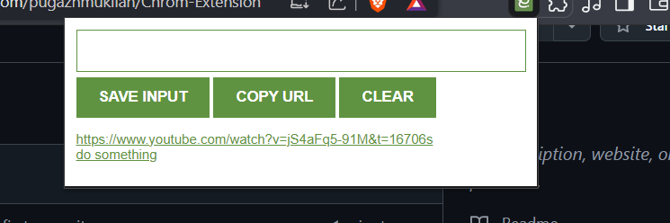

# 🔗 Lead Tracker Chrome Extension



## 📌 Overview

The **Lead Tracker** is a simple yet powerful Chrome extension that helps you save and manage URLs. It allows users to:

- Save URLs from the browser input
- Quickly copy the current tab's URL
- Store links using `localStorage`
- Clear all saved links

This tool is perfect for saving important resources, reading lists, or reference links directly from your browser.

---

## 🧩 Features

- ✅ Save links manually through an input box
- ✅ Save the current tab’s URL with a single click
- ✅ Persist links using `localStorage`
- ✅ Clear all saved links
- ✅ Clickable list that opens links in new tabs

---

## 📁 Project Structure

```plaintext
lead-tracker/
│
├── index.html         # Main HTML file
├── index.css          # Stylesheet (customize as needed)
├── index.js           # Script file with all logic
├── image.png          # Screenshot or UI image
└── README.md          # This file
